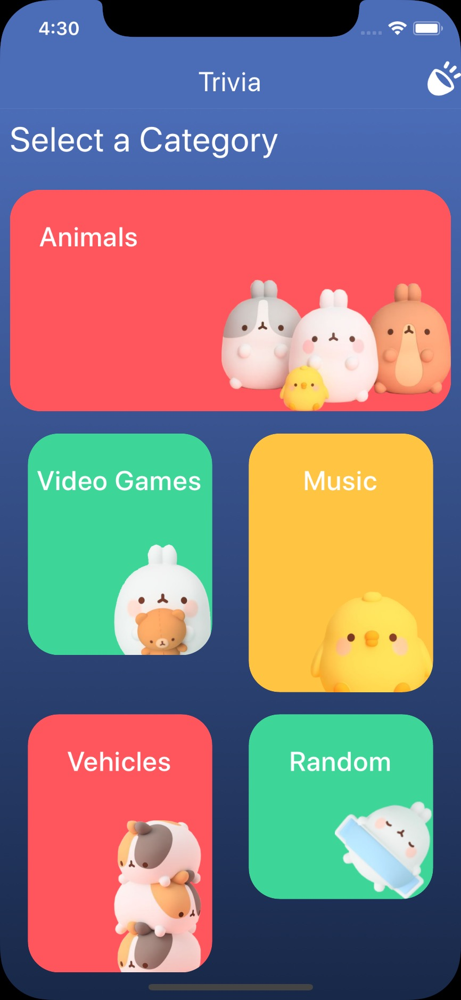
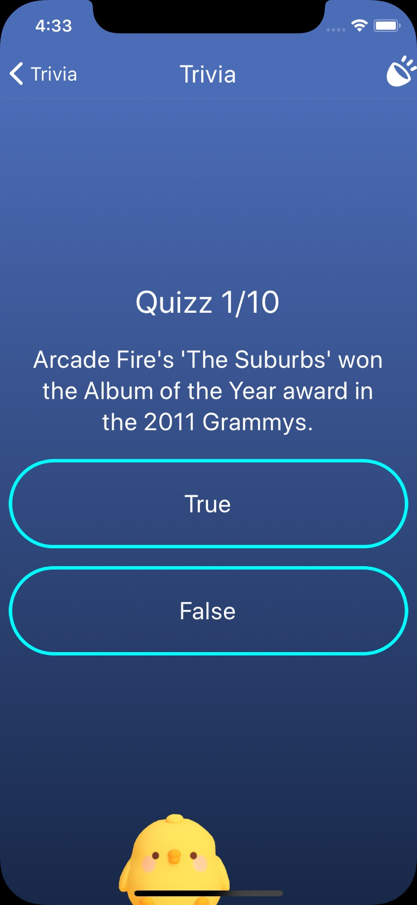
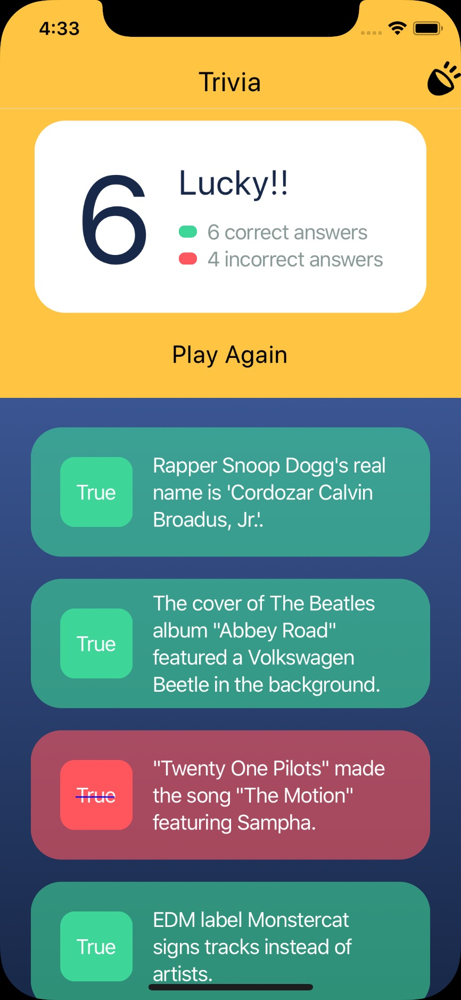

## Steps to run the project

You can watch a 📹 video of the app in action [here](https://www.loom.com/share/59045c7258d14c4bab84f15263542397).

And here are some screenshots:

  
   
  

To try the app, visit this [link](https://expo.io/@haikyuu/challenge?release-channel=production). Note you will need to install the expo app to try it on your phone. You can also try it in the browser in the same link.

To run the project locally:

- Install expo [link](https://docs.expo.io/)
- Install dependencies: `yarn`
- Start the project: `yarn start`

## Folder Structure

The project is simply structured as follow:

- `/assets`: contains images and sounds.
- `/components`: contains components that are big/complex enough to live separately.
- `/screens`: contains the screens of the app. Those are the ones used directly in the navigation.
- `/store`: contains the redux store, reducers, effects and their unit tests.
- `/types`: contains type definition files for the project.
- `/utils`: contains some utilities and configuration that's meant to be used often.

## CI/CD: Continuous integration and deployment

I used github actions for CI/CD and there are 3 workflows:

- PR Review: runs unit tests and linting of the project (prettier, eslint and tsc) and then publishes a preview of the app to a specific channel for each PR.
- Production: Runs unit tests and linting and deploys to the production channel. This workflow runs on each commit to master branch
- Staging: Runs unit tests and linting and deploys to the production channel. This workflow runs on each commit to develop branch.

## Navigation

There are three screens in the app. And their Stack navigator is created using `react-navigation-shared-element` in order to show a shared element transition on navigation.

Navigation is also fully typed. You get awesome autocomplete for the methods like `navigate`.

The results screen doesn't allow going back since the game was over and it would be considered cheating that would allow fixing the last answer.

When answering the quizz, the user is on the same screen and the questions get swapped. So going back is considered like going back to the home screen which is fine (cancel game).

## State management

I am using Rematch which is a redux framework that allows using redux without all the boilerplate associated with it.

The `store` folder contains the models of the app. And each model is self contained.

## Unit Tests

Redux reducers are unit tested since it's the main functionality of the app. Unit tests are also fully typed.

## Components

Most components are not complex enough to justify them living in a separate file, except the `Category` and `HeaderRight` components.

The `Category` component uses configuration stored in `utils/categories.ts` which is bound to be static and contains the category Id, name, image and image dimensions. Note that the design constrained us to use a different size for each image.

## Animations

A shared element transition animation is played when navigating from the home page to quizz screen. And clicking on a category button plays a nice animation that provides visual feedback for the user while loading data for the quizz.

## Sounds & Music

Animations, music and sounds are a must for games. So I used a nice music that's looping and clicks have sounds as well.
The user can control the music from the header.

Music's license is a free one that can be seen here: https://www.bensound.com

## Misc

Some useful tools used in the project:

- Prettier: format code
- Eslint: linting
- Husky & lint-staged: ensure prettier and eslint are run on each commit
- Typescript
- Jest: Unit testing
